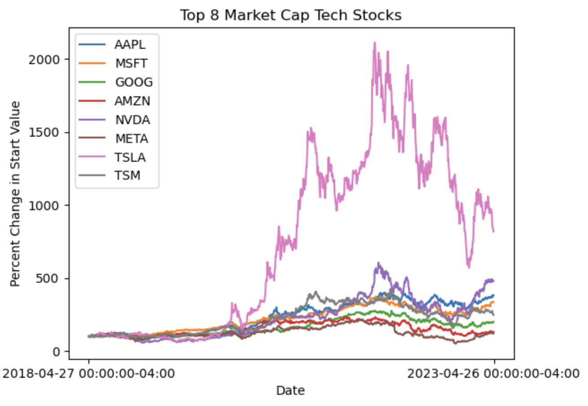
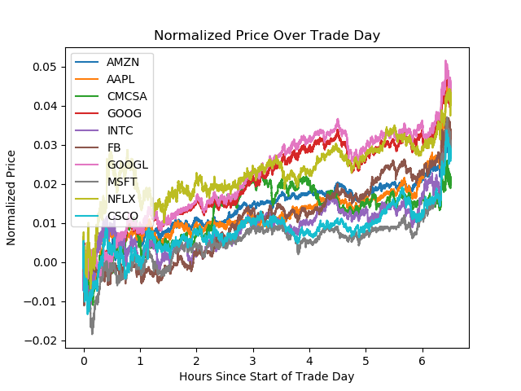

## RL Stock Picking ([Github Page](https://github.com/dtborders/Stock_Market](https://github.com/dtborders/ml-methods/tree/main)))

Examples of ml methods implementations. These implementations include computer vision, time series analysis with RL, etc. See notebooks for examples of the implementations. The most interesting is  [RL w/ Cont Controll for Markets](https://github.com/dtborders/ml-methods/blob/main/deep_continuous_q_learn.ipynb)

## Stock Market Analysis ([Github Page](https://github.com/dtborders/Stock_Market))

[Alpaca](https://alpaca.markets) is a new stock trading brokerage that offers commision free trading with a python-api. Alpaca also offers free real time and historical data access through [Polygon](https://polygon.io), a web api. 

In this project, code was implemented in python to download, visualize, and analyze historical trade data (records of every trade conducted). Volume Weighted Average Price was used for easy visualization/plotting price movement throughout the day. 
Some analysis was conducted on the data, however profitable models were not included in this repostiory. 

## Wine Rating Models ([Github Page](https://github.com/dtborders/Wine_Ratings))

Wine tasting/rating is an arbitrary process involving a complicated combination of many properties (citric acid content, residual sugar, ph, density, alcohol, etc). Becoming a professional wine taster can take years of education, so successfully creating a model to accurately rate wine from machine readings would drastically decrease time and cost. 

The dataset contains readings from bottles of red wine and their corresponding reviews on a 10 point scale. Correlation between quality and properties was examined, and multiple models were created to predict quality score from the wine features. Unfortunately, only on review was given per bottle of wine, so correlation and accuracy between wine tasters could not be examined. 

## Contact Me

I can be contacted any time at dtborders@gmail.com. 
